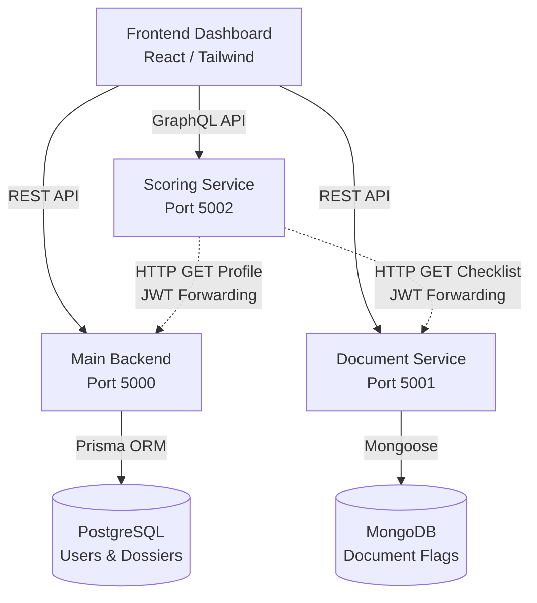

  

# RentTitan

**RentTitan** is an MVP application built by Hamdi Adam Abouleila Selim & Robert Anaïs. It helps tenants create a clear, competitive rental dossier and receive a transparent dossier strength score out of 100. By aggregating financial profiles and securely managing document checklists, RentTitan calculates a deterministic score and provides actionable suggestions to help tenants secure their ideal apartment.

## Architecture

RentTitan utilizes a modern, distributed microservices architecture to handle authentication, document processing, and scoring logic independently.

## Documentation
| Document | Description |
| :--- | :--- |
| [Getting Started Guide](docs/doc-0-getting-started.md) | Step-by-step instructions to run the databases, frontend, and backend locally. |
| [OAuth Initialization & Setup](docs/doc-1-oauth.md) | Details the Google OAuth 2.0 flow and how to configure client credentials. |
| [Frontend & Backend Architecture](docs/doc-2-frontend-backend.md) | Overview of the React component structure and the Express routing/auth flow. |
| [Database Architecture](docs/doc-3-database.md) | Outlines the Docker infrastructure and the PostgreSQL/Prisma schema for users and dossiers. |
| [AI Landlord Pitch](docs/doc-5-ai-pitch.md) | Explains the Gemini AI integration, JWT forwarding, and presentation fallback logic. |
| [Microservices Architecture](docs/doc-4-microservices.md) | Describes the modular services integration and inter-service communication. |

## Tech Stack
- **Frontend:** React / Vite / TailwindCSS
- **Backend:** Node.js / Express / Apollo Server 4 (GraphQL)
- **Databases:** PostgreSQL, MongoDB
- **Authentication:** Google OAuth 2.0 & JSON Web Tokens (JWT)
