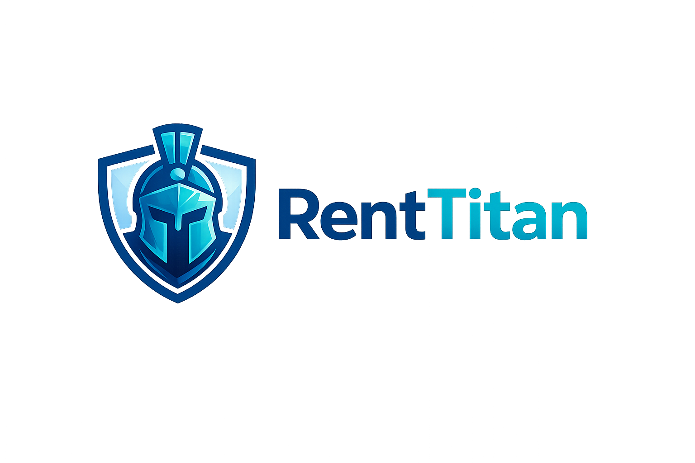
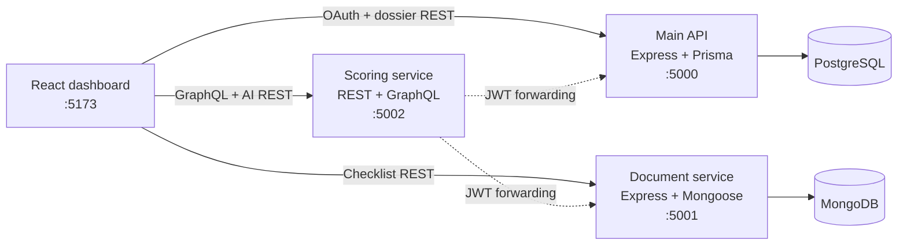

<div align="center">
  

  <h3>Build a rental dossier that landlords can trust.</h3>

  <p>
    RentTitan turns a tenant's financial profile and document checklist into a transparent,
    actionable dossier score—then helps present that profile with a personalized AI landlord pitch.
  </p>

  <p>
    
    
    
    
    
    
  </p>

  <p>
    <a href="#-why-renttitan">Why RentTitan</a> ·
    <a href="#-core-features">Features</a> ·
    <a href="#%EF%B8%8F-architecture">Architecture</a> ·
    <a href="#-quick-start">Quick start</a> ·
    <a href="#-api-surface">API</a> ·
    <a href="#-documentation">Docs</a>
  </p>
</div>

---

## 🏠 Why RentTitan?

In competitive rental markets, applicants often have the right information but no clear way to understand—or communicate—the strength of their dossier. RentTitan makes that process measurable.

The application combines financial data, employment status, guarantor strength, and document completeness into a deterministic score out of 100. Instead of producing a black-box verdict, it shows applicants what is missing and what they can improve.

> **The goal:** turn “Is my dossier strong enough?” into a score, an explanation, and a next action.

## ✨ Core features

| Capability | What it delivers |
| --- | --- |
| **Google OAuth onboarding** | Fast sign-in through Google OAuth 2.0, followed by JWT-protected application routes. |
| **Financial dossier builder** | Capture target rent, monthly income, employment status, and one or more guarantors. |
| **Document checklist** | Track identity, income, address, and guarantor evidence without persisting uploaded file bytes in the MVP. |
| **Transparent score /100** | A deterministic scoring engine with explicit weights and improvement suggestions. |
| **REST + GraphQL access** | The scoring domain is exposed through both REST and Apollo GraphQL interfaces. |
| **AI landlord pitch** | Gemini generates a concise French introduction using the applicant's real profile data. |
| **Resilient AI fallback** | A data-aware local template keeps the pitch flow usable if Gemini is unavailable or rate-limited. |

## 🎯 How scoring works

RentTitan's score is intentionally explainable. Each category maps to a visible part of the applicant's dossier:

| Signal | Weight | Full-credit condition |
| --- | ---: | --- |
| Document completeness | 25 | All five required document categories are present |
| Rent affordability | 25 | Target rent is no more than 33% of monthly income |
| Guarantor strength | 25 | Guarantor income is at least 3× the target rent |
| Profile stability | 15 | Permanent employment (`CDI`) |
| Profile clarity | 10 | Core financial fields are complete |
| **Total** | **100** | |

The response also includes missing-document indicators and concrete suggestions, so the score is useful rather than merely decorative.

## 🏗️ Architecture

RentTitan separates identity and dossier management, document-state tracking, and score computation into independently owned services.



The scoring service forwards the caller's JWT when requesting profile and checklist data. This keeps each service responsible for its own data while preserving the authenticated user context across service boundaries.

### Service map

| Service | Port | Responsibility | Data/API |
| --- | ---: | --- | --- |
| Frontend | `5173` | Login, protected dashboard, profile form, uploads, score, AI pitch | React 19, Vite, Tailwind CSS |
| Main backend | `5000` | OAuth, JWT issuance and verification, dossier and guarantor management | Express, Prisma, PostgreSQL |
| Document service | `5001` | Per-user checklist state and simulated upload/remove flows | Express, Multer, Mongoose, MongoDB |
| Scoring service | `5002` | Score calculation, suggestions, GraphQL aggregation, Gemini pitch generation | Express, Apollo Server, Gemini |

## 🧰 Tech stack

| Layer | Technologies |
| --- | --- |
| UI | React 19, React Router 7, Vite 8, Tailwind CSS 4 |
| APIs | Node.js, Express 5, Apollo Server 4, GraphQL 16 |
| Identity | Google OAuth 2.0, Passport, JSON Web Tokens |
| Data | PostgreSQL 15, Prisma, MongoDB 6, Mongoose |
| AI | Google Gemini via `@google/genai`, with a deterministic offline fallback |
| Local infrastructure | Docker Compose |

## 🚀 Quick start

### Prerequisites

- Node.js 18+
- npm
- Docker with Docker Compose
- Google OAuth credentials for the complete sign-in flow
- A Gemini API key for live AI output (optional—the fallback still works without it)

### 1. Clone and configure

```bash
git clone https://github.com/Selim-Abouleila/RentTitan.git
cd RentTitan
cp .env.example .env
```

Fill in `GOOGLE_CLIENT_ID`, `GOOGLE_CLIENT_SECRET`, and optionally `GEMINI_API_KEY` in the root `.env`. The database connection strings already match the development containers in `docker-compose.yml`.

### 2. Start PostgreSQL and MongoDB

```bash
docker compose up -d
```

### 3. Install dependencies and initialize PostgreSQL

```bash
cd backend
npm install
npx prisma migrate dev

cd ../frontend
npm install

cd ../microservices/document-service
npm install

cd ../scoring-service
npm install
```

### 4. Run the four processes

Open four terminals from the repository root:

```bash
# Terminal 1 — Main API
cd backend && npm run dev

# Terminal 2 — Document service
cd microservices/document-service && node src/index.js

# Terminal 3 — Scoring service
cd microservices/scoring-service && node src/index.js

# Terminal 4 — Frontend
cd frontend && npm run dev
```

Open **http://localhost:5173**.

<details>
<summary><strong>Environment variables</strong></summary>

| Variable | Purpose | Required |
| --- | --- | --- |
| `FRONTEND_URL` | OAuth redirect target and allowed frontend origin | Yes |
| `JWT_SECRET` | Signs and verifies application tokens | Yes |
| `GOOGLE_CLIENT_ID` | Google OAuth web client ID | For Google login |
| `GOOGLE_CLIENT_SECRET` | Google OAuth web client secret | For Google login |
| `DATABASE_URL` | PostgreSQL connection used by Prisma | Yes |
| `MONGODB_URI` | MongoDB connection used by the document service | Yes |
| `GEMINI_API_KEY` | Enables live Gemini pitch generation | No |

Never commit a populated `.env` file or production secrets.

</details>

## 🔌 API surface

All protected endpoints expect `Authorization: Bearer <token>`.

| Method | Endpoint | Service | Purpose |
| --- | --- | --- | --- |
| `GET` | `/auth/google` | Main backend | Begin Google OAuth |
| `GET` | `/auth/google/callback` | Main backend | Complete OAuth and issue a JWT |
| `GET` | `/dossiers` | Main backend | Fetch the authenticated user's dossier |
| `POST` | `/dossiers` | Main backend | Create or update a dossier and guarantors |
| `GET` | `/status` | Document service | Fetch checklist state |
| `POST` | `/upload` | Document service | Mark a document category as supplied |
| `DELETE` | `/documents/:documentType` | Document service | Remove a checklist item |
| `GET` | `/api/v1/dossier-score` | Scoring service | Calculate the score through REST |
| `POST` | `/graphql` | Scoring service | Query `myDossier` through GraphQL |
| `POST` | `/api/v1/ai/generate-pitch` | Scoring service | Generate a personalized landlord pitch |

Example GraphQL query:

```graphql
query MyDossier {
  myDossier {
    score
    missingDocuments
    suggestions
  }
}
```

## 🗂️ Repository structure

```text
RentTitan/
├── frontend/                       # React SPA
├── backend/                        # OAuth, JWT and dossier REST API
│   └── prisma/                     # PostgreSQL schema and migrations
├── microservices/
│   ├── document-service/           # MongoDB-backed checklist service
│   └── scoring-service/            # Scoring, GraphQL and Gemini integration
├── docs/                           # Focused engineering documentation
├── docker-compose.yml              # PostgreSQL + MongoDB development stack
└── .env.example                    # Shared local configuration template
```

## 📚 Documentation

| Guide | Focus |
| --- | --- |
| [Getting started](docs/doc-0-getting-started.md) | Local databases, configuration, migrations, and service startup |
| [Google OAuth](docs/doc-1-oauth.md) | Consent screen, credentials, callback flow, JWT handoff |
| [Frontend and backend](docs/doc-2-frontend-backend.md) | React components, routing, middleware, and dossier API |
| [Database architecture](docs/doc-3-database.md) | PostgreSQL, MongoDB, Prisma models, and relationships |
| [Microservices](docs/doc-4-microservices.md) | Service boundaries, token forwarding, APIs, and scoring |
| [AI landlord pitch](docs/doc-5-ai-pitch.md) | Gemini prompt flow and graceful fallback behavior |

## 🔒 Security and MVP boundaries

RentTitan is an educational MVP, not a production tenant-screening service.

- API routes are protected with signed JWTs and service-to-service requests preserve the user's authorization context.
- Uploaded document bytes are intentionally discarded in memory; MongoDB stores checklist state only.
- Development database credentials in `docker-compose.yml` are local defaults and must be replaced outside local development.
- The current frontend stores its JWT in `localStorage`; a production deployment should evaluate an `HttpOnly`, `Secure`, `SameSite` cookie strategy, CSRF protection, input validation, rate limiting, secret rotation, and encrypted object storage.
- The score is a transparent product demonstration, not legal, financial, or housing eligibility advice.

## 🛣️ Roadmap

- [ ] Persist encrypted documents in object storage with type and size validation
- [ ] Add unit, integration, and end-to-end test suites
- [ ] Containerize application services and add one-command orchestration
- [ ] Add CI for linting, tests, builds, and dependency auditing
- [ ] Introduce production-grade session handling and security controls
- [ ] Add deployment configuration, observability, and health checks

## 👥 Team

Built by **Adam Hamdi**, **Selim Abouleila**, and **Anaïs Robert**.

---

<div align="center">
  <strong>RentTitan</strong><br />
  A clearer rental dossier. A stronger application.
</div>
